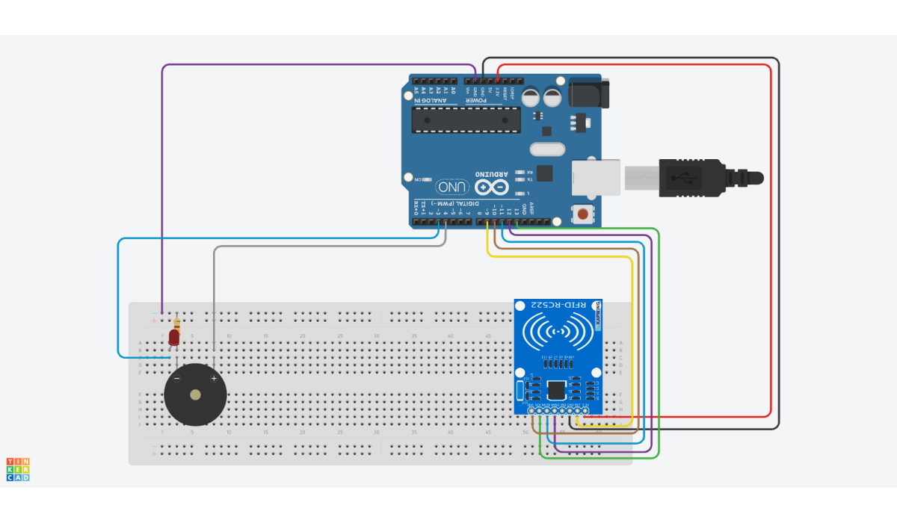

# RFID Attendance System

The RFID Attendance System is a project that allows you to track the attendance of students using RFID technology. This system uses an Arduino board, Node.js, Express, Mongoose, and React to capture RFID data, store it in a database, and display a list of present students in a web interface.

## How It Works
The system works as follows:

1. The RFID reader captures data from RFID cards and sends it to the Arduino board.
2. The Arduino board communicates with a Node.js server using the serialport library. The server stores the list of present students in a MongoDB database using Mongoose.
3. The web-based user interface is built using React. The interface displays the list of present students, which is updated in real-time as students swipe their RFID cards.

## Installation

To use the RFID Attendance System, you'll need to have the following software installed on your machine:

- Node.js
- Arduino IDE

To get started with the project, follow these steps:

1. Clone this repository to your local machine using Git or by downloading the ZIP file.
2. Open the Arduino IDE and in the menu bar, go to `Sketch > Include Library > Add .ZIP Library...` to add the `/arduino/rfid-master.zip`. You can also download this library from [here](https://github.com/miguelbalboa/rfid).

<p align="center">
  
</p>

3. To make the Arduino connections according to the above circuit schematic, follow these steps:
    - Connect the RFID-RC522 reader's SDA pin to pin 10 on the Arduino Uno board.
    - Connect the RFID-RC522 reader's SCK pin to pin 13 on the Arduino Uno board.
    - Connect the RFID-RC522 reader's MOSI pin to pin 11 on the Arduino Uno board.
    - Connect the RFID-RC522 reader's MISO pin to pin 12 on the Arduino Uno board.
    - Connect the RFID-RC522 reader's GND pin to the GND pin on the Arduino Uno board.
    - Connect the RFID-RC522 reader's RST pin to pin 9 on the Arduino Uno board.
    - Connect the RFID-RC522 reader's 3.3V pin to the 3.3V pin on the Arduino Uno board.
    - Connect an LED to pin 3 and a Peizo Buzzer on pin 4 along with a resistor in series.  (Remember: The shorter end of LED and buzzer goes to GND).

4. Upload the code from `/arduino/arduino.ino` to the Arduino board.

5. In the `backend`, open a terminal and run the following command to install the dependencies:
```
npm install
```
6. Similarly, In the `frontend`, open a terminal and run the following command to install the dependencies:
```
npm install
```
5. Create a `.env` file in the `backend/` directory and add your MongoDB connection string as the value of the DB_URL variable. 
```
DB_URL=mongodb://[username:password@]host1[:port1][,...hostN[:portN]][/[defaultauthdb][?options]]
```
6. Start the Node.js server by running `npm start` in the `backend/` directory of the project.
7. Start the React frontend by running npm start in the frontend/ directory of the project.
8. Navigate to http://localhost:3000 in your web browser to view the web interface.

Note: If you encounter any errors or issues during the installation process, please consult the Troubleshooting section below.

## Usage

To use the RFID Attendance System, follow these steps:

1. Students should each have an RFID card or tag with a unique ID.
2. When a student enters the classroom, they should scan their RFID card using the RFID reader connected to the Arduino board.
3. The Arduino board will send the RFID data to the Node.js server using the Serialport library.
4. The Node.js server will store the data in a MongoDB database using the Mongoose library.
5. The React frontend will display a list of present students on the web interface, which can be accessed by navigating to `http://localhost:3000`.

## Troubleshooting

If you encounter any issues while setting up or using the RFID Attendance System, try the following solutions:

- Make sure that you have all of the required software installed on your machine.
- Double-check that the Arduino code has been uploaded to the board correctly and that the RFID reader is connected properly.
- Check the console for any error messages that may indicate a problem with the Node.js server or the React frontend.
- If you're having trouble connecting to the MongoDB database, make sure that it is running and that you have the correct connection string in the `.env` file.

If none of these solutions work, please create an issue for further assistance.